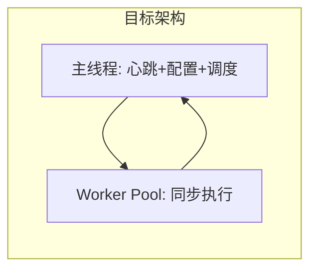

# sync-manage 节点集成 — 对齐结论与实现约定

> 对照文档：`sync-manage/docs/节点集成文档.md`  
> 节点项目：`github-openclaw-xgkb-sync`

---

## 1. 总览

| 结论 | 说明 |
|------|------|
| **配置对齐问题已在中心侧解决** | 中心按可配置白名单比对 `reportedConfig`；下发 payload 仅含托管字段 |
| **节点不维护白名单副本** | 白名单由 sync-manage 配置，随时可增删；节点只对 **`data.config` 做 merge** |
| **节点侧接入** | **已实现**（配置 `centralManagerUrl` 后启用） |

---

## 2. 已确认的实现约定（2026-06）

### 2.1 配置下发：按响应 merge，不列固定字段

- 中心托管哪些字段由 **sync-manage 自行配置**（`sync-manage.managed-fields`），会随产品演进变化。
- **节点不在代码里写死白名单列表**。
- 心跳响应若带 `data.config`：
  1. 将 `data.config` 中的**顶层字段**合并进当前内存/磁盘配置（有则覆盖，无则不动）。
  2. 若含 `mappings` 数组：按 `mappingId` **upsert**；响应里未出现的 mapping **保留**（不删）。
  3. 写入 `config.json`（原子写）→ 更新 `localConfigVersion = data.configVersion` → 触发 reload。
- **禁止**用 `data.config` 整文件替换本地 `config.json`（会丢失 watch、限流、stateDbPath 等自治字段）。

### 2.2 `reportedConfig` 上报

- 上报**当前实际运行的完整** `config.json` 内容（含 appKey 明文）。
- 中心侧自行提取白名单字段做比对；节点无需裁剪。

### 2.3 `appKey` 明文

- 心跳 body 与 `reportedConfig` 中 **按文档传明文 appKey**，与 sync-manage 约定一致，不做节点侧脱敏。

### 2.4 `maxConcurrentMappingsMode`

- 中心已从 DB 读取真实值（不再写死 `manual`），与节点 `auto`/`manual` 比对一致。**此项已关闭。**

---

## 3. 原对齐问题状态

| # | 问题 | 状态 |
|---|------|------|
| 1 | 全量 JSON 比对误报 | **已解决（中心白名单比对）** |
| 2 | 下发覆盖自治字段 | **已解决（中心只下发托管字段 + 节点 merge）** |
| 3 | `syncDirection` 枚举 | **一致** `bidirectional` / `push` / `pull` |
| 4 | `localConfigVersion` | **已实现**（config.json + 应用中心 config 后更新） |
| 5 | `mappingStats` schema | **文档 + DTO 已定义** |
| 6 | 自动升级 | **已实现**（心跳触发 + `autoUpgradeEnabled`） |
| 7 | `nodeId` 真实 IP | **已实现** `src/nodeIdentity.ts` |
| 8 | appKey 明文 | **按约定明文上报** |

---

## 4. 节点 merge 伪代码（实现参考）

```text
function applyCentralConfig(local: SyncConfig, patch: Record<string, unknown>, configVersion: number) {
  const next = { ...local, ...omit(patch, 'mappings') };

  if (Array.isArray(patch.mappings)) {
    const byId = new Map(local.mappings.map(m => [m.mappingId, m]));
    for (const item of patch.mappings) {
      const id = item.mappingId;
      byId.set(id, { ...(byId.get(id) ?? {}), ...item });
    }
    next.mappings = [...byId.values()];
  }

  next.localConfigVersion = configVersion;  // 持久化字段名以实现为准
  writeConfigFile(next);
  reload();
}
```

身份相关字段变更（如 `localRoot` / `projectId` / `appKey`）后，沿用现有 **resetMappingState** 逻辑（与 Web 改 mapping 一致）。

---

## 5. 仍须知晓（非阻塞）

| 项 | 说明 |
|----|------|
| `mappingStats` | 中心可能暂仅日志；节点已按文档上报，大盘见 §7.4 |
| 制品包升级 | 仍无 `artifactUrl`；当前走 git tag，见 §7.5 |
| 中心删除 mapping | merge 仅 upsert，中心响应未出现的 mapping **不删本地**（有意保留自治） |

---

## 6. 接入清单

- [x] `centralReporter`：`POST .../heartbeat`，Header `X-Node-Id`
- [x] body：`version`、`ipAddress`、运行指标、**完整 `reportedConfig`**、**明文 appKey**、`mappingStats`、`localConfigVersion`
- [x] 响应：`latestAppVersion` → 自动升级；`config` → **merge** + reload
- [x] 每轮 sync 结束 → `POST .../execution-log`
- [ ] 发版：Nacos `openclaw.sync.latest-version` + [RELEASE_TAG.md](./RELEASE_TAG.md)（运维操作）
- [ ] 与 sync-manage 端到端联调（配置 `centralManagerUrl` 后验证 ONLINE / 流水 / 配置下发）

---

## 7. 待优化任务（非阻塞，路线图）

> 来源：sync-manage《节点集成文档》§3「同步服务节点推荐高性能架构设计指南」。  
> **说明**：下列为性能与可靠性演进项，**不阻塞**当前节点接入上线；契约层能力（§6）已实现。

### 7.1 Worker Threads：主控制线程与执行线程池分离

| 维度 | 内容 |
|------|------|
| **建议** | 主线程只负责心跳、配置拉取/merge、任务调度；同步执行（walk、MD5、KB 上传下载）放入 `worker_threads` 或子进程池 |
| **现状** | 单进程单主线程；`CentralReporter` 独立定时器；`/health` 已有 `eventLoopLagMs` / `degraded` |
| **风险** | 大目录全量、密集 API 时事件循环阻塞，心跳可能延迟 |
| **触发条件** | 线上长期 `event_loop_lag_high`，或黑盒探针偶发超时 |
| **优先级** | P2（按监控数据决定） |
| **注意** | 需解决 SQLite 状态、chokidar、配置热更新跨线程/进程边界，改动面大 |



### 7.2 中心配置：按 Mapping「Pending Reload」平滑应用

| 维度 | 内容 |
|------|------|
| **建议** | 心跳收到 `config` 后，对**正在同步**的 mapping 仅打 `pendingConfigReload` 标记；本轮结束并上报 `execution-log` 后，再应用新参数启动下一轮 |
| **现状** | 已满足：**单 mapping** 在同步中再次触发时有 `pendingSync` 排队；**中心下发**走 `merge` 写盘 + **整调度器 `doReload()`**（等待进行中 sync → 停 Scheduler → 重建） |
| **差距** | 非文档描述的 per-mapping 配置延迟生效；reload 失败时可能出现「磁盘已更新但内存未生效」，需手动重载或下轮心跳重试 |
| **已有** | `writeConfigFile` 已用 `config.json.tmp` + rename（写配置隔离 ✅） |
| **优先级** | P2（仅在频繁中心改配置且与长同步冲突时考虑） |

### 7.3 执行路径：全面异步非阻塞 I/O

| 维度 | 内容 |
|------|------|
| **建议** | 哈希、遍历、传输统一 `fs.promises` / `createReadStream` 等，避免同步阻塞 API |
| **现状** | 主路径已异步；未做 Worker 级隔离 |
| **优先级** | P3（与 §7.1 合并评估即可） |

### 7.4 sync-manage 中心：`mappingStats` 大盘落库

| 维度 | 内容 |
|------|------|
| **建议** | 中心将心跳中的 `mappingStats` 持久化并在 Web 大盘展示 |
| **现状** | 节点已上报；中心侧可能仅 `log.debug` |
| **优先级** | P2（中心产品需求） |

### 7.5 自动升级：制品包 `artifactUrl`（可选契约）

| 维度 | 内容 |
|------|------|
| **建议** | 心跳响应增加 `artifactUrl` + `artifactSha256`，节点下载解压切换版本，减少对 git 的依赖 |
| **现状** | 仅 `latestAppVersion`；升级脚本走 git tag + pm2/systemd（[RELEASE_TAG.md](./RELEASE_TAG.md)） |
| **优先级** | P3（内网无 git 或需离线包时再推进） |

### 7.6 中心下发 mapping 删除策略（产品待定）

| 维度 | 内容 |
|------|------|
| **建议** | 若中心期望「期望态 = 全量 mapping 列表」，需约定：中心未下发的 mapping 是否删除本地 |
| **现状** | **不删除**本地多余 mapping，仅 upsert 中心下发的项 |
| **优先级** | P3（需与 sync-manage 产品对齐后再改） |

### 7.7 任务优先级汇总

| 优先级 | 任务 | 负责侧 |
|--------|------|--------|
| P0（运维） | 联调 + Nacos 发版 | 运维 / 双方 |
| P2 | Worker 线程池隔离 | 节点 |
| P2 | 中心配置 per-mapping Pending Reload | 节点 |
| P2 | mappingStats 大盘 | sync-manage |
| P3 | artifactUrl 升级 | 双方契约 + 节点 |
| P3 | 中心驱动 mapping 删除 | 产品 + 节点 |

---

## 8. 相关文档

- sync-manage [节点集成文档.md](../../../cwork-server/sync-manage/docs/节点集成文档.md)（§3 为架构建议原文）
- [central-manager-node-identity-and-auto-upgrade.md](./central-manager-node-identity-and-auto-upgrade.md)
- [RELEASE_TAG.md](./RELEASE_TAG.md)
